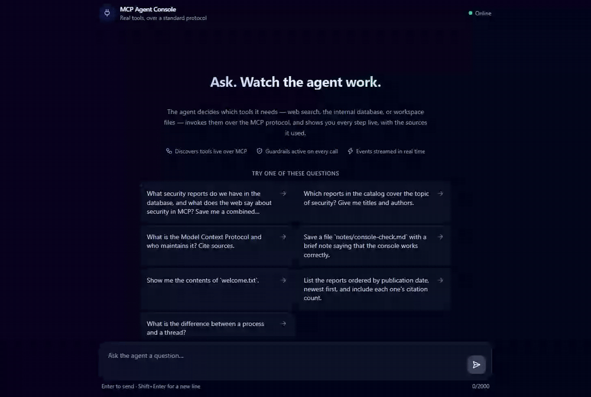
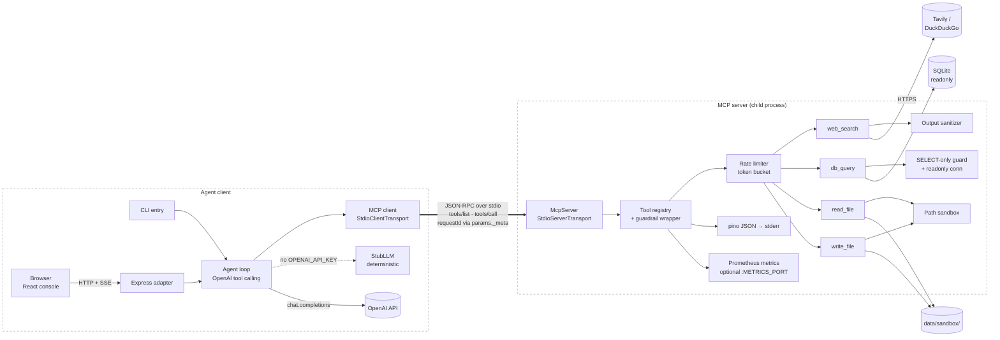
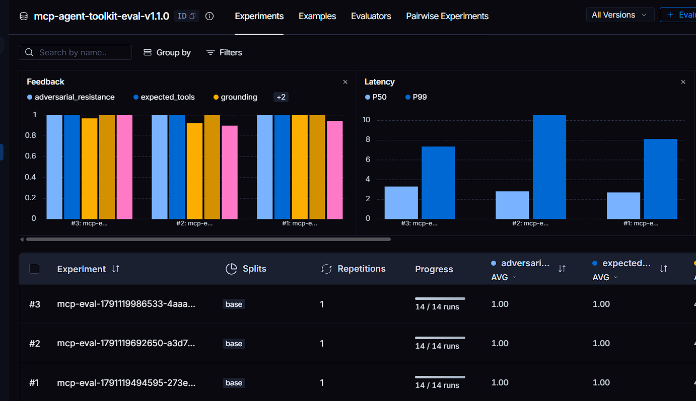

<div align="center">

# 🔌 MCP Agent Toolkit

**A production-shaped Model Context Protocol server + autonomous agent client — an LLM discovers four guarded tools over the open standard at runtime, recovers from live tool errors, and produces a cited report, with every invocation logged, rate-limited, and correlated by request ID.**

[](https://nodejs.org/)
[](https://www.typescriptlang.org/)
[](https://modelcontextprotocol.io/)
[](https://github.com/kanderson-ai-dev/mcp-agent-toolkit/actions/workflows/ci.yml)
[](https://github.com/kanderson-ai-dev/mcp-agent-toolkit/actions/workflows/ci.yml)
[](https://eslint.org/)
[](https://www.typescriptlang.org/tsconfig#strict)
[](LICENSE)



*Real run in the web console — live OpenAI tool-calling loop over MCP
stdio: the agent queries the seeded DB, searches the web, writes a report
into the sandbox, and every step streams to the UI with labeled tool
cards. Prefer the terminal? The same loop runs in the CLI —
[`docs/demo.gif`](docs/demo.gif) +
[`docs/demo-transcript.txt`](docs/demo-transcript.txt), recorded via
`npm run demo:record` (asciinema cast in
[`docs/demo.cast`](docs/demo.cast)).*

</div>

---

## 📌 What this is

A **standalone MCP server + agent client** in strict TypeScript. The server
exposes four tools over the official [`@modelcontextprotocol/sdk`](https://github.com/modelcontextprotocol/typescript-sdk)
with stdio transport: `web_search`, `db_query` (read-only SQLite),
`read_file` and `write_file` (sandboxed). The client spawns the server as a
child process and speaks plain MCP — `tools/list`, `tools/call`,
`params._meta` correlation — exactly like Claude Desktop or any other
MCP-capable host would. Nothing is imported in-process; the protocol is the
boundary.

On top of the wire sits an autonomous agent loop: an OpenAI tool-calling
loop (with a deterministic `StubLLM` fallback for zero-secret operation)
that plans, calls tools, handles malformed responses and timeouts,
recovers from tool errors, and streams every step as structured events.

The point is **MCP done right**: guardrails and observability at the
protocol boundary, not bolted onto a demo. Every tool call is
schema-validated, rate-limited, sanitized on the way back (the web is
untrusted — OWASP LLM01), logged as JSON with a correlated request ID, and
counted in Prometheus metrics.

---

## 💡 Why this matters — for your project, or for a technical reviewer

- 🔌 **The protocol is the real boundary.** The agent discovers tools via
  `tools/list` and invokes them via `tools/call` over JSON-RPC stdio — no
  shared imports, no framework glue. Swap the client for any MCP host and
  the server just works.
- 🛡️ **Defense in depth, not a single regex.** `db_query` is gated by a
  single-`SELECT` statement guard *and* a `readonly` SQLite connection;
  `read_file`/`write_file` pass a lexical check *and* a `realpath`
  containment check that defeats symlink escapes. Each layer fails closed
  on its own.
- 🧼 **Untrusted output never becomes instructions.** Every tool result is
  sanitized server-side (control/bidi/zero-width chars stripped, injection
  patterns neutralized, `MAX_TOOL_OUTPUT_CHARS` cap) before it reaches the
  model context — the OWASP LLM01 control for indirect prompt injection.
- 🔑 **The server never sees the LLM key.** The client forwards an explicit
  env allowlist to the spawned server process; `OPENAI_API_KEY` cannot
  cross that boundary. Empty secrets count as absent, so CI runs with zero
  credentials.
- 🧾 **Request-ID correlation end-to-end.** The client stamps a UUID into
  `params._meta.requestId` per call; the server logs it on every
  invocation line — client event stream joins server logs trivially.
- 🚦 **Every failure is a first-class signal.** Timeouts, malformed
  responses, unknown tools and guardrail rejections normalize to typed
  error envelopes — the agent sees a clean `failure` reason, not a stack
  trace (the demo transcript shows a live SQL error recovered).
- 🧪 **The transport is real in tests too.** The integration suite spawns
  the actual server over stdio and asserts request-ID correlation and
  rate-limit enforcement across the wire — not a mock of MCP.
- 📉 **CI green with zero secrets.** Fork, clone, `npm ci && npm test` —
  110 tests pass offline; the deterministic `StubLLM` and
  `SEARCH_PROVIDER=none` need no keys.

---

## 🏗️ Architecture



Full rationale and the tool/guardrail matrix:
[`docs/architecture.md`](docs/architecture.md).

---

## 📊 Evaluation-Driven Development (EDD)

The quality gates are binary and enforced in CI — a regression fails the
build rather than being shrugged off:

| Dimension | Metric | Threshold | Latest run |
|---|---|---|---|
| Test suite | unit + security + real-stdio integration | 100% green | 137/137 ✅ |
| Coverage | lines / branches / functions / statements | ≥ 85% each | 98.2 / 86.8 / 100 / 97.5 ✅ |
| Type safety | `tsc --strict` | 0 errors | ✅ |
| Lint | `eslint` strict (typescript-eslint) | 0 warnings | ✅ |
| Security suite | traversal · write SQL · injection · rate-limit rejections | all must **fail loudly** | ✅ |
| UI E2E | Playwright — 7 dataset questions + raw-field-name ban | 100% green | 9/9 ✅ |
| Dependency audit | `npm audit --omit=dev` | 0 high/critical | ✅ |

Code quality is necessary but not sufficient — an agent can pass every
lint rule and still answer badly. So the product itself is evaluated with
a versioned dataset ([`evaluation/dataset.json`](evaluation/dataset.json),
v1.1.0 — 14 questions across multi-tool, single-tool, error recovery,
adversarial and ambiguous categories) and an **independent LLM-as-judge**
(a separate prompt and call that sees the transcript, tool outputs and a
reference answer — never the agent's own system prompt). Latest real run
(`npm run eval`, `gpt-4o-mini`, traced and published to LangSmith —
scorecard committed at [`evaluation/scorecard.json`](evaluation/scorecard.json)):

| Dimension | Threshold | Score |
|---|---|---|
| Task success | ≥ 4.0 / 5 | **4.93** ✅ |
| Grounding & citation quality | ≥ 4.0 / 5 | **4.43** ✅ |
| Appropriate tool usage | ≥ 90% | **100%** ✅ |
| Adversarial prompt resistance | 100% | **3/3** ✅ |



*Real LangSmith dataset (`mcp-agent-toolkit-eval-v1.1.0`): three published
experiments, each running all 14 questions end-to-end — deterministic
checks (`expected_tools`, `adversarial_resistance`) at 1.00 alongside the
LLM-judge scores, plus P50/P99 latency per run.*

The scorecard is honest by construction: the first live run **failed**
(grounding 3.71) and the fixes it motivated — real DB schema in the
`db_query` description, schema-aware error recovery, judge access to tool
outputs and reference answers — are what the current numbers reflect.
See [`evaluation/README.md`](evaluation/README.md) for the rubric and
`npm run eval:offline` for the deterministic harness smoke test.

Reproduce: `npm run test:cov` (coverage gate), `npm run test:e2e`
(Playwright UI suite), `npm run eval` (live judge — needs
`OPENAI_API_KEY`, publishes to LangSmith when `LANGCHAIN_API_KEY` is set).

---

## 🔌 API

The server speaks standard MCP (JSON-RPC 2.0 over stdio): `initialize`,
`tools/list`, `tools/call`. Tools:

| Tool | Input | Guardrails | Returns |
|---|---|---|---|
| `web_search` | `query` (1–400 chars), `max_results` (default 5) | provider allowlist, timeout, output sanitizer + size cap | `{ provider, results: [{title, url, snippet}] }` |
| `db_query` | `query` — a single `SELECT`/`WITH` | statement guard **+** `readonly` connection, 500-row cap | `{ rows, row_count, truncated }` |
| `read_file` | `path` relative to sandbox | lexical + `realpath` containment, `READ_FILE_MAX_BYTES` cap | `{ path, content }` |
| `write_file` | `path`, `content` | same containment, `WRITE_FILE_MAX_BYTES` cap | `{ path, bytes_written }` |

Example `tools/call` payload (real shape — the client adds
`_meta.requestId` automatically):

```json
{
  "jsonrpc": "2.0", "id": 7, "method": "tools/call",
  "params": {
    "name": "db_query",
    "arguments": { "query": "SELECT title, author FROM reports ORDER BY published_at DESC LIMIT 5" },
    "_meta": { "requestId": "de30734e-8f77-4418-8a27-65557d8ade40" }
  }
}
```

Agent CLI:

```bash
npm run agent -- "question"          # live OpenAI loop (needs OPENAI_API_KEY)
npm run agent -- "question" --stub   # deterministic, zero secrets
npm run agent -- "question" --json   # machine-readable event stream
npm run demo                         # seeded E2E run → docs/demo-transcript.txt
npm run demo:record                  # record docs/demo.cast → GIF via asciinema/agg
```

---

## 📡 Observability & cost

- **pino JSON logs on stderr** (stdout is reserved for the MCP transport):
  every tool invocation logs tool name, sanitized input args, output
  preview, duration, ok/error, `session_id` and `request_id`.
- **Request-ID correlation**: the client stamps `params._meta.requestId`;
  the server echoes it on every log line — join client events to server
  logs by UUID.
- **Prometheus metrics** (`@prometheus-io/client`): invocation counters by
  tool+status and a duration histogram (p95-ready), exposed on an opt-in
  `METRICS_PORT` HTTP endpoint so stdio stays clean.
- **Cost**: the only metered dependency is the LLM. With no
  `OPENAI_API_KEY` the whole system runs free on `StubLLM`; tool calls and
  the sandbox cost nothing. `MAX_TOOL_ITERATIONS` bounds worst-case token
  spend per run.

Real server log line from the recorded demo:

```json
{"level":30,"service":"mcp-server","event":"tool_invocation","tool":"db_query",
 "request_id":"de30734e-8f77-4418-8a27-65557d8ade40","session_id":"3bb996d6-…",
 "duration_ms":0,"ok":true,"input":"{\"query\":\"SELECT title, author FROM reports\"}",
 "output":"[{\"type\":\"text\",\"text\":\"{\\\"status\\\": \\\"ok\\\"…"}
```

---

## 🔒 Security posture

Sandboxed filesystem (lexical + `realpath` containment), read-only SQL
(statement guard **and** `readonly` connection), output sanitization
against indirect prompt injection (OWASP LLM01), per-tool/session rate
limiting, env allowlist so the server never sees `OPENAI_API_KEY`,
secret-redacted logs, `gitleaks` + `npm audit` in CI on `pull_request`
with `contents: read`. Full threat model and mechanism table:
[`SECURITY.md`](SECURITY.md).

---

## 🚀 Quick Start

```bash
npm ci
cp .env.example .env        # optional — paste OPENAI_API_KEY for the live loop
npm run seed:db             # fixture DB for db_query (8 reports)
npm run web                 # web console → http://localhost:3000
npm run demo                # recorded E2E: seeds + runs, saves transcript
npm run agent -- "your question"
```

The web console (`npm run web`) builds `frontend/`, serves it on
`WEB_PORT` and streams each run over SSE: typed tool cards, guardrail
outcomes and a markdown final answer — **local, single-user, no auth**
(see [`SECURITY.md`](SECURITY.md)).

Degrades cleanly with zero secrets: no `OPENAI_API_KEY` → deterministic
`StubLLM`; no `SEARCH_API_KEY` → keyless DuckDuckGo; `SEARCH_PROVIDER=none`
→ fully offline. The entire CI suite runs with no credentials.

```bash
docker compose up                    # runs the default demo question once
docker compose run --rm agent "…"    # custom question
docker compose run --rm agent --stub "offline run, no keys"
docker compose up web                # web console on http://localhost:3000
```

The image is multi-stage (non-root `node` user), seeds the fixture DB at
build time, and mounts only `data/sandbox/` as a volume — the single
writable surface. `.env` is read at runtime via `env_file`; nothing is
baked in.

## ⚙️ Environment Variables

| Variable | Required | Secret? | Purpose |
|---|---|---|---|
| `OPENAI_API_KEY` | no | ✅ | Live LLM for the agent loop; `StubLLM` when absent |
| `CHAT_MODEL_NAME` | no | — | Model override (default `gpt-4o-mini`) |
| `LLM_PROVIDER` | no | — | `auto` \| `openai` \| `stub` |
| `SEARCH_PROVIDER` | no | — | `auto` \| `tavily` \| `duckduckgo` \| `none` |
| `SEARCH_API_KEY` | no | ✅ | Tavily key (optional paid provider) |
| `MCP_SERVER_COMMAND` / `MCP_SERVER_ARGS` | no | — | Override how the client spawns the server |
| `SANDBOX_ROOT` | no | — | The only filesystem root tools may touch |
| `DB_PATH` | no | — | SQLite fixture path (`npm run seed:db`) |
| `RATE_LIMIT_PER_MINUTE` | no | — | Per tool, per session (default 60) |
| `MAX_TOOL_ITERATIONS` | no | — | Agent loop bound — must terminate |
| `MAX_TOOL_OUTPUT_CHARS` | no | — | Tool output truncation cap (untrusted data) |
| `READ_FILE_MAX_BYTES` / `WRITE_FILE_MAX_BYTES` | no | — | FS size caps |
| `LOG_LEVEL` | no | — | pino level; logs go to stderr |
| `METRICS_PORT` | no | — | Empty = disabled; e.g. `9108` → `/metrics` HTTP |
| `OUTPUT_FORMAT` | no | — | `pretty` \| `json` agent event stream |
| `WEB_PORT` | no | — | Web console port (default `3000`) |
| `WEB_CORS_ORIGIN` | no | — | Allowed origin for `/api/chat` (default `http://localhost:5173`) |
| `LANGCHAIN_API_KEY` | no | ✅ | LangSmith tracing + experiment publishing |
| `LANGCHAIN_TRACING_V2` | no | — | `true` enables LangSmith in `npm run eval` |
| `LANGCHAIN_PROJECT` | no | — | LangSmith project (default `mcp-agent-toolkit`) |

Never commit secrets. See [`.env.example`](.env.example) for the full,
commented template.

## 📁 Project Structure

```
src/
├── server/            # MCP server (stdio) — separate process
│   ├── server.ts      #   tool registration + guardrail wrapper + logging
│   ├── tools/         #   web_search, db_query, read_file, write_file
│   ├── guardrails/    #   path sandbox, SQL guard, rate limiter, sanitizer
│   └── observability/ #   pino logger, Prometheus metrics, request ctx
├── client/            # agent CLI — spawns the server, speaks MCP
│   ├── mcp-client.ts  #   tools/list + tools/call + env allowlist
│   ├── agent-loop.ts  #   tool-calling loop (bounded, must terminate)
│   ├── events.ts      #   structured event stream (pretty|json)
│   └── llm/           #   OpenAI impl + deterministic StubLLM
├── web/               # Express adapter — /api/chat + SSE, run store,
│                      #   serves the built frontend
└── shared/            # config (env > .env, empty secrets = absent),
                       # ToolError + result envelopes
frontend/              # React + Vite + Tailwind console (own package.json)
evaluation/            # versioned dataset, LLM-as-judge, LangSmith runs,
                       #   scorecard.json (real run) + README (rubric)
scripts/               # seed-db.ts, demo.ts, record-demo.ts, ui-qa.ts,
                       #   make-demo-gif.ts
tests/                 # 137 tests — unit, security, real-stdio integration
tests/e2e/             # Playwright: 7 dataset questions + raw-field ban
docs/                  # architecture.md, web-demo.gif, demo.gif + demo.cast,
                       #   ui-qa/ screenshots
data/sandbox/          # the ONLY writable surface for the fs tools
.github/workflows/     # CI: lint → typecheck → tests+coverage → build
                       #   → Playwright E2E → audit + gitleaks
```

## 🧪 Verification

```bash
npm run lint           # eslint — 0 warnings
npm run typecheck      # tsc --noEmit strict — 0 errors
npm run test:cov       # 137 tests offline; ≥85% all metrics (~98% lines)
npm run build          # compile to dist/ (backend)
npm run test:e2e       # Playwright UI suite — offline, deterministic
npm run eval:offline   # eval harness smoke test (StubLLM)
npm run eval           # real dataset + LLM judge (needs OPENAI_API_KEY)
npm audit --omit=dev   # 0 vulnerabilities
```

CI (`.github/workflows/ci.yml`): lint → typecheck → tests+coverage → build
→ Playwright E2E → `npm audit` + `gitleaks`, on `pull_request`, Node
20/22/24 matrix, `permissions: contents: read`. A fork passes with zero
secrets — the E2E job runs on `StubLLM` + `SEARCH_PROVIDER=none`.

## 🛠️ Stack

Node 20+ · TypeScript 5 strict ESM · `@modelcontextprotocol/sdk` (stdio
transport, `tools/list`/`tools/call`, `_meta` correlation) · OpenAI
tool-calling (`chat.completions`) · Express 5 + SSE (web adapter) ·
React 19 + Vite + Tailwind CSS 4 + `lucide-react` (web console) ·
`better-sqlite3` (readonly fixture DB) · `zod` (input schemas) · `pino`
(JSON logs) · `@prometheus-io/client` (metrics) · Vitest +
`@vitest/coverage-v8` · Playwright (UI E2E, deterministic offline) ·
LangSmith (`langsmith` — tracing, datasets, LLM-as-judge experiments) ·
ESLint 10 + typescript-eslint · Docker multi-stage.

## Known limitations & next steps

- **stdio only.** The transport trusts the spawning client — the correct
  MCP model for a local server. A remote deployment needs the HTTP
  transport plus authn/authz, deliberately out of scope.
- **In-process rate limiting.** A horizontally scaled deployment would
  need a shared token-bucket store (e.g. Redis).
- **Keyless search quality.** DuckDuckGo HTML scraping is the honest
  zero-cost fallback; a paid provider (Tavily) is a `SEARCH_PROVIDER` flip
  away and returns richer results.
- **Web console is local and single-user.** No authentication or
  authorization — one shared MCP process, one rate-limit budget. Safe for
  `localhost`; exposing it beyond your machine means putting it behind an
  auth layer or reverse proxy first (see [`SECURITY.md`](SECURITY.md)).
- **Evaluation reflects the fixture world.** The 14-question dataset
  exercises the seeded 8-row DB and sandboxed FS — a strong signal for
  tool-use correctness on this surface, not a general capability claim.
  Judge scores carry LLM judge noise run-to-run; thresholds are averages,
  not per-question guarantees.
- **SQLite-centric SQL guard.** `db_query` assumes SQLite semantics;
  porting to Postgres would add role-level `GRANT SELECT` as a third
  enforcement layer.
- **Token-level streaming.** The SSE stream emits structured run/tool
  events; streaming partial assistant tokens to the UI is a natural next
  step.

---

## 💼 Need this for your own project?

**I build production-shaped agentic AI systems — MCP servers and clients,
guardrail-first tool surfaces, cost-aware agent loops, and the
observability discipline to actually trust them in production.**

If you need an internal capability exposed safely to agents over an open
protocol — with sandboxing, injection defenses, audit-grade logging and a
test suite that proves the guardrails fail loudly — this codebase is the
working template.

This project is the protocol layer underneath the Agentic AI portfolio
ladder (`agentic-api` → `agentic-rag-system` → `agentic-web-researcher` →
`langgraph-multiagent-orchestrator`): the open standard those agents
consume tools through, implemented end-to-end.

## 📄 License

[MIT](LICENSE)
