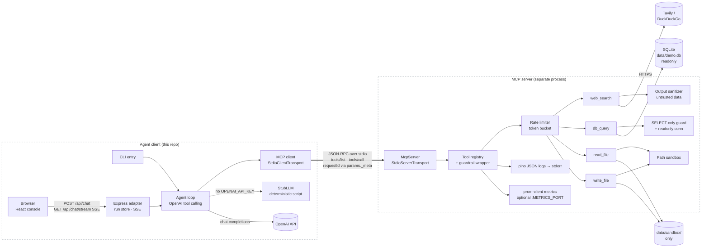

# Architecture

An autonomous agent (OpenAI tool-calling loop) talks to a standalone MCP
server **exclusively over the Model Context Protocol** — the server is a
separate process spawned over stdio. The agent never imports tool code; it
discovers tools at runtime via `tools/list` and invokes them via
`tools/call`, exactly like any MCP-capable host would.

## Surfaces — CLI vs Web console

Both surfaces drive the **same** `runAgent` loop and the same MCP child
process — no agent logic is duplicated; the web layer is a thin adapter.

| | CLI (`npm run agent`) | Web console (`npm run web`) |
|---|---|---|
| Entry point | `src/client/index.ts` | `src/web/index.ts` |
| Surface | Terminal event stream (pretty/JSON) | Browser UI — React + Tailwind (`frontend/`) |
| Transport to the loop | Direct `emit` callback | HTTP + SSE (`POST /api/chat` → `GET /api/chat/stream`) |
| MCP server | Spawned per CLI invocation | One child process shared for the server lifetime |
| Concurrency | One run per invocation | Run store: single-use, TTL-expired run ids |
| Auth | n/a — local process | **None — local single-user console** (see `SECURITY.md`) |

## Tool inventory

| Tool | Purpose | Security surface | Guardrail |
|---|---|---|---|
| `web_search` | Query the live web (Tavily, or keyless DuckDuckGo fallback; `none` = offline stub) | Network egress + **indirect prompt injection** via results (OWASP LLM01) | Provider allow-list, timeouts, output sanitization + size cap |
| `db_query` | Run a read-only SQL query against a seeded SQLite fixture | SQL injection / write statements | Statement guard (single `SELECT`, denylist) **and** a `readonly` connection — defense in depth |
| `read_file` | Read a text file inside the sandbox | Path traversal, symlink escape | Path sandbox (canonical containment check), size cap |
| `write_file` | Persist text (e.g. the final report) inside the sandbox | Path traversal, disk abuse | Path sandbox, size cap |

## Cross-cutting

- **Request-ID correlation:** the client stamps a UUID into
  `params._meta.requestId` on every `tools/call`; the server logs it on
  every JSON log line, so client → server → tool traces join trivially.
- **Observability:** pino JSON logs on **stderr** (stdout is reserved for
  the MCP transport); Prometheus exposition is opt-in via `METRICS_PORT`
  so stdio mode stays clean.
- **Zero-secret operation:** no `OPENAI_API_KEY` → deterministic
  `StubLLM`; no `SEARCH_API_KEY` → keyless DuckDuckGo;
  `SEARCH_PROVIDER=none` → fully offline. The entire test suite and CI run
  with no credentials.

## Use case

A **researcher agent CLI**: the user asks a question; the agent searches
the web and/or queries the fixture DB for evidence, then calls
`write_file` to persist a cited report into `data/sandbox/`. A single
prompt exercises 2+ tools over the standard protocol.
